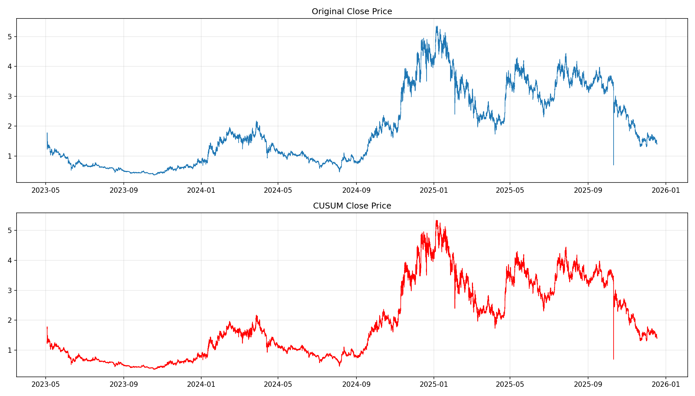
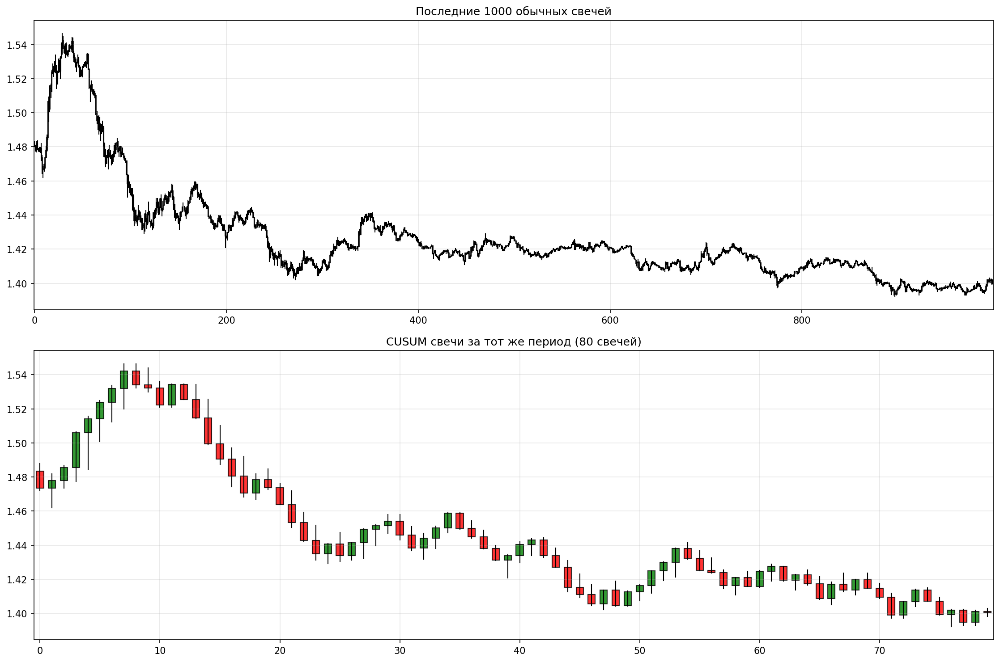

# CUSUM Candlestick Generator

A Python tool for generating CUSUM (Cumulative Sum) candlesticks from traditional OHLCV (Open, High, Low, Close, Volume) financial data. CUSUM candlesticks are formed based on cumulative price movements reaching a specified threshold, rather than fixed time intervals.

## Features

- **CUSUM Candlestick Generation**: Converts traditional time-based candlesticks to movement-based CUSUM candlesticks
- **Data Validation**: Comprehensive validation of CUSUM transformation including continuity checks and OHLC correctness
- **Visualization**: Creates comparison charts between original and CUSUM candlesticks
- **Candlestick Charts**: Generates detailed candlestick comparison plots
- **Configurable Threshold**: Adjustable CUSUM threshold for different sensitivity levels

## How CUSUM Candlesticks Work

CUSUM candlesticks are created by tracking cumulative price movements:
- **Upward CUSUM**: Accumulates positive price changes
- **Downward CUSUM**: Accumulates negative price changes
- **New Candle Formation**: A new CUSUM candle is formed when either the upward or downward CUSUM reaches the specified threshold

This approach creates candlesticks based on significant price movements rather than time, potentially providing better insights into market dynamics.

## Example Results

For a typical cryptocurrency dataset:
- **Original candles**: 50,000+ time-based candles
- **CUSUM candles**: 5,000-15,000 movement-based candles
- **Compression ratio**: 3-10x reduction in data points while preserving significant price movements

### Sample Output Charts

**Price Comparison Chart**

*Comparison between original time-based price data (top) and CUSUM-based price data (bottom)*

**Candlestick Comparison Chart**

*Detailed candlestick comparison showing the last 1000 regular candles vs corresponding CUSUM candles*

## Installation

1. Clone this repository:
```bash
git clone <repository-url>
cd cusum-candlestick-generator
```

2. Install required dependencies:
```bash
pip install -r requirements.txt
```

## Usage

1. **Prepare your data**: Ensure your CSV file contains the following columns:
   - `open_time`: Timestamp of the candle
   - `open`: Opening price
   - `high`: Highest price
   - `low`: Lowest price
   - `close`: Closing price

2. **Configure the script**: Edit the configuration section in `cusum.py`:
   ```python
   INPUT_CSV = "OHLCV.csv"  # Your input CSV file
   CUSUM_THRESHOLD = 0.005   # 0.5% threshold (adjust as needed)
   OUTPUT_PNG = "cusum_comparison.png"
   CANDLESTICK_PNG = "cusum_candlestick_comparison.png"
   ```

3. **Run the script**:
   ```bash
   python cusum.py
   ```

## Output

The script generates several outputs:

1. **Console Output**:
   - Number of original candles
   - Number of CUSUM candles generated
   - Compression ratio
   - Validation results

2. **Charts**:
   - `cusum_comparison.png`: Line chart comparing original vs CUSUM close prices
   - `cusum_candlestick_comparison.png`: Detailed candlestick comparison of the last 1000 candles

## Configuration Options

- **CUSUM_THRESHOLD**: Controls the sensitivity of CUSUM candle formation
  - Lower values (e.g., 0.001 = 0.1%) create more candles with smaller movements
  - Higher values (e.g., 0.01 = 1%) create fewer candles with larger movements
  
- **n_candles**: Number of recent candles to display in candlestick comparison (default: 1000)

## Example Results

For a typical cryptocurrency dataset:
- **Original candles**: 50,000+ time-based candles
- **CUSUM candles**: 5,000-15,000 movement-based candles
- **Compression ratio**: 3-10x reduction in data points while preserving significant price movements

## Data Validation

The script includes comprehensive validation:
- **Continuity Check**: Ensures no gaps between consecutive CUSUM candles
- **OHLC Validation**: Verifies that high/low values are consistent with open/close
- **Logic Verification**: Reconstructs CUSUM logic to validate threshold-based candle formation

## Requirements

- Python 3.7+
- pandas >= 1.5.0
- numpy >= 1.21.0
- matplotlib >= 3.5.0
- tqdm >= 4.64.0

## Contributing

Feel free to submit issues, feature requests, or pull requests to improve this tool.

## License

This project is open source. Please check the license file for details.

## Disclaimer


This tool is for educational and research purposes. Always validate results and use appropriate risk management when applying to trading strategies.
